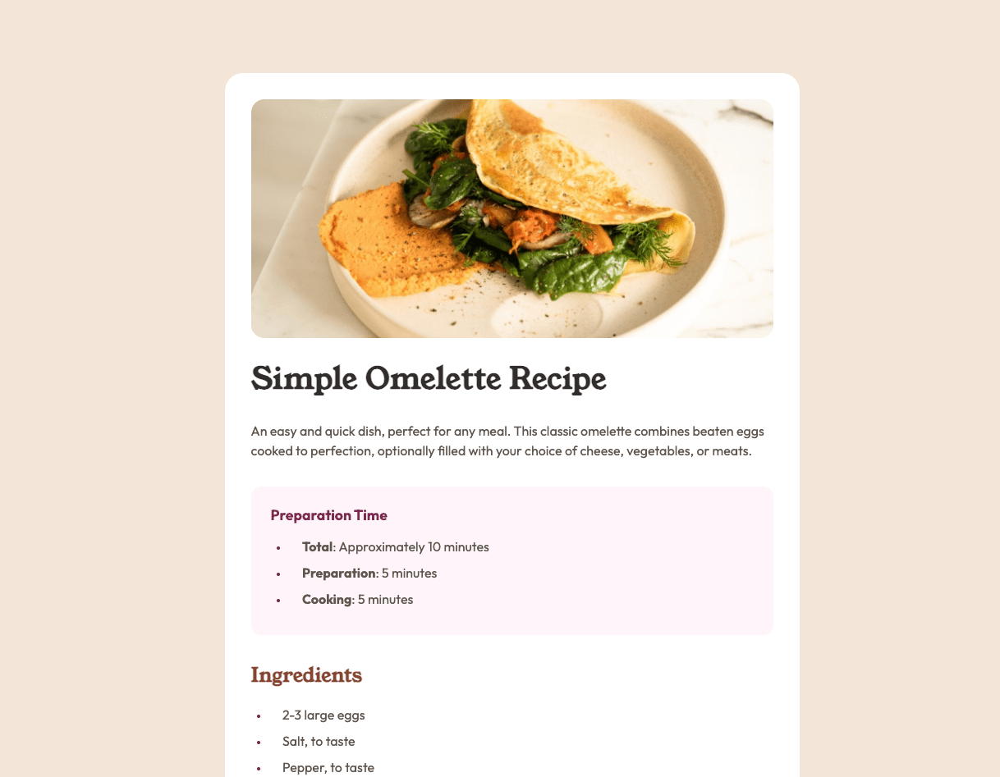

# Frontend Mentor - Recipe page solution

This is a solution to the [Recipe page challenge on Frontend Mentor](https://www.frontendmentor.io/challenges/recipe-page-KiTsR8QQKm). Frontend Mentor challenges help you improve your coding skills by building realistic projects.

## Table of contents

- [Overview](#overview)
  - [Screenshot](#screenshot)
  - [Links](#links)
- [My process](#my-process)
  - [Built with](#built-with)
  - [What I learned](#what-i-learned)
  - [Continued development](#continued-development)
- [Author](#author)

## Overview

### Screenshot

### Links

- Solution URL: [Code](https://github.com/bryancarias/RecipePage)
- Live Site URL: [Demo](https://recipe-page-red-mu.vercel.app/)

## My process

### Built with

- HTML
- CSS

### What I learned

I had to review topics on media queries, pseudo-elements, and pseudo-classes.

## Author

- Frontend Mentor - [@bryancarias](https://www.frontendmentor.io/profile/bryancarias)
